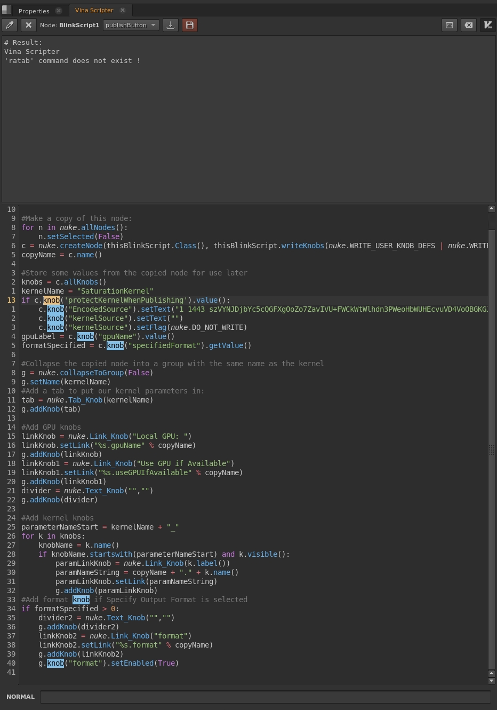

# Vina Scripter
Python and Blinkscript editor for Nuke, based on the VIM editor,
inspired by <a href=https://github.com/adrianpueyo/KnobScripter target='_blank'>KnobScripter</a>, but rewritten,
the idea that is simpler and more useful and without the option to edit external files,
and just it will support Nuke with Python 3, not to dirty the code,
to make it compatible with older nukes, do a Fork.


# Feautres
- Edit <b>Temporary Scripts</b> to make it work and create ':tabnew' tabs and close them 'tabclose'
- Ability to edit any <b>Expression</b> of any knob in python
- Automatic detection of the <b>Blinkscript</b> knob
- It is scalable to add more shortcuts and missing <b>VIM</b> commands

# Installation
1 - Copy to nuke folder
```sh
# Linux:
git clone --recursive https://github.com/vinavfx/vina_scripter.git "~/.nuke/vina_scripter"

# Windows
# Download git: https://git-scm.com/download/win
git clone --recursive https://github.com/vinavfx/vina_scripter.git "C:\Users\<username>\.nuke\vina_scripter"

# Or manually copy the entire git downloaded folder and its submodules to the nuke user folder
```

2 - Copy this line to <b>menu.py</b>
```python
import vina_scripter
```

# Basic Use
To use the editor without vim mode, press the 'Vim' button on the top right, and it will work like a normal editor !
- <b>:w</b> : Save script to node
- <b>:wq</b> : Save node and Exit
- <b>:q</b> : Exit node
- <b>:tabnew</b> : New script page
- <b>:tabclose</b> : Close script page
- <b>:tabo</b> : Close all except the current page
- <b>:1, :2, :3...</b> : Go to line
- <b>/</b> : Search
- <b>:retab</b> : Change the indentation to 4 spaces

- <b>i</b> : Insert mode
- <b>v</b> : Visual mode
- <b>V</b> : Visual Line mode
- <b>Ctrl+[</b> : Exit modes and exit selected words
- <b>*</b> : Find word under cursor

- For all shortcuts and commands see them here, <a href=https://vim.rtorr.com target='_blank'>vim.rtorr.com</a>
not all vim shortcuts are implemented in <b>Vina Scripter</b> !
In this script are all available shortcuts, in case you want to change them at will.
<a href=./src/vim/keys_vim_mode.py target='_blank'>keys_vim_mode.py</a>


# Screenshots

- <b>TABS</b>


- <b>COMMAND LINE</b> 


- <b>NORMAL</b> Mode


- <b>INSERT</b> Mode


- <b>VISUAL</b> Mode


- <b>VISUAL LINE</b> Mode


- <b>BLINKSCRIPT</b> Code


- <b>PYTHON</b> Code


